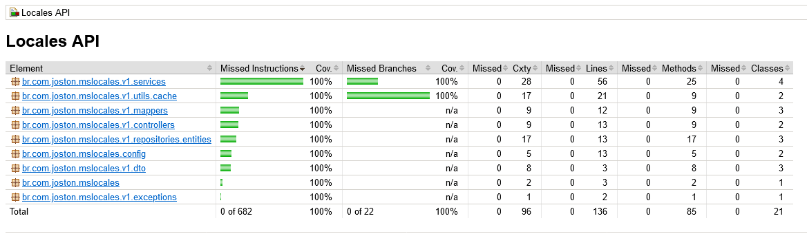

# ms-locales-java-api
An API to retrieve countries, states, and cities.

This API demonstrates how to develop a Spring Boot project using Java 17, JUnit, MongoDB, and Docker.

## Project tests
This project uses the Jacoco plugin to check test coverage.

## Docker
Don't forget to replace the username and password phrases with your own username and password in both the docker and application.properties files.
